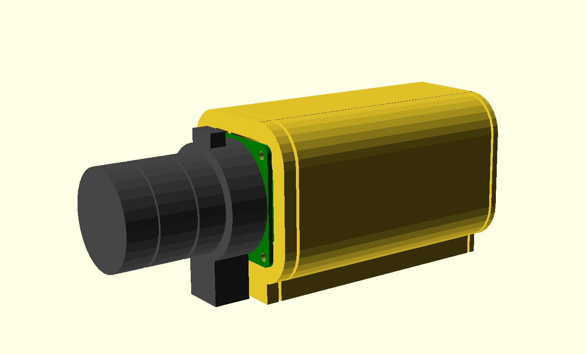

# open-sentinel
Open Source IP Camera design

## Goals
- **Open**: 100% open source IP camera providing a trusted platform
- **Flexible**: Supports many different Raspberry Pi cameras

## Features
- **RPi CM5** for AI accelerator support
- **3D printed enclosure** So anyone can build it

## Current Status
- CAD design is underway
- PCB design has begun
- Firmware not yet started

